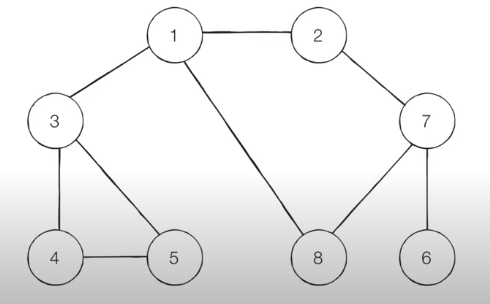

# 4주차 내용정리

## 📌 DFS (Depth-First Search)

DFS는 깊이 우선 탐색이라고도 부르며, 그래프에서 깊은 부분을 우선적으로 탐색하는 알고리즘이다.

DFS는 스택 자료구조(혹은 재귀함수)를 이용하며, 구체적인 동작 과정은 다음과  같다.

1. 탐색 시작 노드를 스택에 삽입하고 방문처리.
2. 스택의 최상단 노드에 방문하지 않은 인접한 노드가 하나라도 있으면 그 노드를 스택에 넣고 방문처리. 방문하지 않은 인접 노드가 없으면 스택에서 최상단 노드를 꺼냄.
3. 더 이상 2번의 과정을 수행할 수 없을 때 까지 반복

다음의 그래프를 DFS로 탐색해본다고 가정하자.(방문 순서는 1번부터 시작하여 인접한 노드중 번호가 낮은 노드를 방문)




탐색 순서 : 1→ 2 → 7 → 6 → 8 → 3 → 4 → 5

- 위의 과정을 문제와 코드로 구현해본다면?
    
    첫번째 줄에 노드의 갯수 N와 간선의 갯수 M가 주어지고, 탐색을 시작할 정점의 번호 V가 주어진다. 다음 M개의 줄에는 간선이 연결하는 두 정점의 번호가 주어진다. (간선은 양방향이라고 가정)
    
    DFS로 탐색한 순서를 출력하여라.
    
    **입력 예시** 
    
    8 9 1
    
    1 2
    
    1 3
    
    1 8
    
    2 7
    
    3 4
    
    3 5
    
    4 5
    
    6 7
    
    7 8
    
    **출력 예시**
    
    1 2 7 6 8 3 4 5
    
    - 정답 코드
        
        ```java
        import java.util.*;
        
        public class Main {
            private static boolean[] visited;
            private static int n;
            private static int m;
            private static int[][] arr;
            private static StringBuilder sb;
            
            public static void main(String[] args) {
                Scanner sc = new Scanner(System.in);
        
                n = sc.nextInt(); //노드의 갯수
                m = sc.nextInt(); //간선의 갯수
                int start = sc.nextInt();   //탐색을 시작할 정점의 번호
                arr = new int[n+1][n+1];
        
                // 간선의 갯수만큼 연결정보 입력받기
                for(int i=1; i<=m; i++) {
                    int vertex1 = sc.nextInt();
                    int vertex2 = sc.nextInt();
        
                    arr[vertex1][vertex2] = 1;
                    arr[vertex2][vertex1] = 1;
                }
        
                solution(start);
                System.out.println(sb);
            }
        
            private static void solution(int start) {
                sb = new StringBuilder();
        
                visited = new boolean[n + 1];
        
                visited[start] = true; //시작 노드를 방문처리
                sb.append(start).append(" ");
                dfs(1);
            }
        
            private static void dfs(int vertex) {
                for(int i=1; i<=n; i++) {
                    if(arr[vertex][i] == 1) { //연결된 노드일 경우.
                        if(!visited[i]) { //방문하지 않은 노드일 경우.
                            visited[i] = true;  //방문처리
                            sb.append(i).append(" ");
                            dfs(i);
                        }
                    }
                }
            }
        }
        ```
        
    

## 📌 BFS(Breadth-First Search)

BFS는 너비 우선 탐색이라고도 부르며, 그래프에서 가까운 노드부터 우선적으로 탐색하는 알고리즘이다.

BFS는 큐 자료구조를 이용하며, 구체적인 동작 과정은 다음과 같다.

1. 탐색 시작 노드를 큐에 삽입하고 방문 처리를 한다.
2. 큐에서 노드를 꺼낸 뒤에 해당 노드의 인접 노드 중에서 방문하지 않은 노드를 모두 큐에 삽입하고 방문처리한다.
3. 더 이상 2번의 과정을 수행할 수 없을 때 까지 반복한다.


탐색 순서 : 1 → 2 → 3 → 8 → 7 → 4 → 5 → 6

- 위의 과정을 문제와 코드로 구현해본다면?
    
    입력 예시는 위의 DFS와 같습니다.
    
    ```java
    import java.util.*;
    
    public class Main {
        private static boolean[] visited;
        private static int n;
        private static int m;
        private static int[][] arr;
        private static StringBuilder sb;
    
        public static void main(String[] args) {
            Scanner sc = new Scanner(System.in);
    
            n = sc.nextInt(); //노드의 갯수
            m = sc.nextInt(); //간선의 갯수
            int start = sc.nextInt();   //탐색을 시작할 정점의 번호
            arr = new int[n+1][n+1];
    
            // 간선의 갯수만큼 연결정보 입력받기
            for(int i=1; i<=m; i++) {
                int vertex1 = sc.nextInt();
                int vertex2 = sc.nextInt();
    
                arr[vertex1][vertex2] = 1;
                arr[vertex2][vertex1] = 1;
            }
    
            solution(start);
            System.out.println(sb);
        }
    
        private static void solution(int start) {
            visited = new boolean[n+1];
            bfs(start);
        }
    
        private static void bfs(int start) {
            sb = new StringBuilder();
            Queue<Integer> queue = new LinkedList<>();
            visited[start] = true; //시작 노드번호 방문 처리
            queue.add(start); //탐색시작 노드 큐에 넣기
            sb.append(start).append(" ");
    
            while(!queue.isEmpty()) { //큐가 빌 때 까지 반복.
                int current_node = queue.poll();
    
                // 연결정보 탐색
                for(int i=1; i<=n; i++) {
                    if(arr[current_node][i] == 1) { //i번 노드랑 연결되어있는지 확인.
                        if(!visited[i]) {   //방문하지않았다면.
                            queue.add(i); //큐에 넣기
                            visited[i] = true;  //방문 처리
                            sb.append(i).append(" ");
                        }
                    }
                }
            }
        }
    }
    ```
    

## 📌그래프 이론


그래프는 무방향그래프, 방향그래프, 가중치그래프가 있다.

그래프 표현 식 G(V, E) → Vertex와 Edge로 구성되어있는 집합체 라는 뜻 !

1. 무방향 그래프
2. 방향 그래프
3. 가중치 방향 그래프

## 📌이진 트리 순회 연습


이진 트리 순회의 방식은 다음과 같이 3가지 방식이 있다.

- 전위순회
    - **부모노드** → 왼쪽 서브노드 → 오른쪽 서브노드
- 중위순회
    - 왼쪽 서브노드 → **부모노드** → 오른쪽 서브노드
- 후위순회
    - 왼쪽 서브노드 → 오른쪽 서브노드 → **부모노드**

**부모노드를 언제 방문하는지에 따라서 전위순회, 중위순회, 후위순회가 정해짐.**

```java
import java.util.*;

public class Main {

    static class Node {
        int root;
        Node lt;
        Node rt;

        Node(int root) {
            this.root = root;
            lt = null;
            rt = null;
        }
    }

    public static void main(String[] args) {
        // depth = 0
        Node root = new Node(1);

        // depth = 1
        root.lt = new Node(2);
        root.rt = new Node(3);

        // depth = 2
        root.lt.lt = new Node(4);
        root.lt.rt = new Node(5);
        root.rt.lt = new Node(6);
        root.rt.rt = new Node(7);

        dfs(root);
    }

    public static void dfs(Node node) {
        if(node == null) return;
        else {
            if(node.lt != null) dfs(node.lt);
						if(node.rt != null) dfs(node.rt);
        }
    }
}
```

## 📌 4주차 과제

**DFS, BFS**

[[프로그래머스] - 타겟 넘버](https://school.programmers.co.kr/learn/courses/30/lessons/43165)

[[백준] - DFS와 BFS](https://www.acmicpc.net/problem/1260)

[[백준] - 바이러스](https://www.acmicpc.net/problem/2606)

[[백준] - 섬의 개수](https://www.acmicpc.net/problem/4963)

[[백준] - 미로탐색](https://www.acmicpc.net/problem/2178)

[[백준] - 토마토](https://www.acmicpc.net/problem/7576)

[[백준] - 유기농 배추](https://www.acmicpc.net/problem/1012)

문제 풀기 전 참고하면 좋은 강의

[https://www.youtube.com/watch?v=7C9RgOcvkvo&t=2614s](https://www.youtube.com/watch?v=7C9RgOcvkvo&t=2614s)